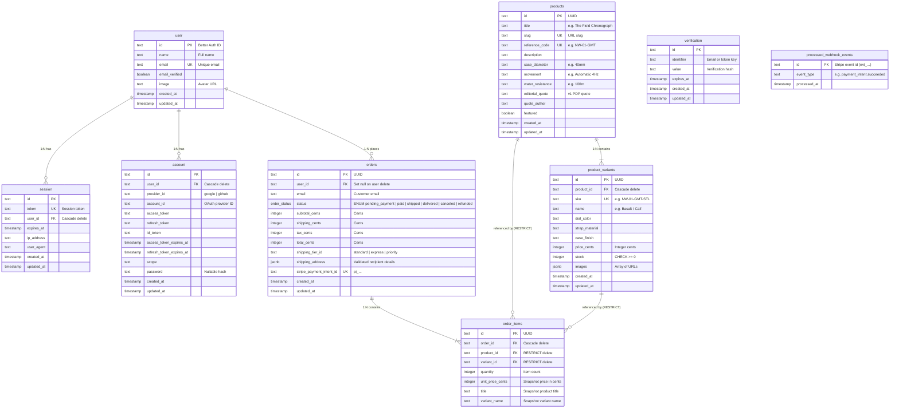

# Northwatch Database Schema Architecture

Entity-Relationship Diagram and architectural reference for the Neon Postgres database managed by Drizzle ORM.

---

## 1. Visual Entity-Relationship Diagram (Mermaid)

---

## 2. Invariant Checklist

1. **Monetary Integrity**: All prices, taxes, shipping fees, and totals are strictly stored as `integer` cents (e.g. `$740.00` = `74000`).
2. **Historical Integrity**: `order_items` snapshots `title`, `variant_name`, and `unit_price_cents` so historical invoices never mutate if a product is updated or discontinued.
3. **Inventory Safety**: `CHECK ("stock" >= 0)` on `product_variants` prevents race conditions from driving stock into negative values.
4. **Webhook Idempotency**: `processed_webhook_events` logs Stripe event IDs to ensure duplicate webhooks are safely ignored.
5. **Enums**: `order_status` is an immutable PostgreSQL ENUM preventing malformed status states.
